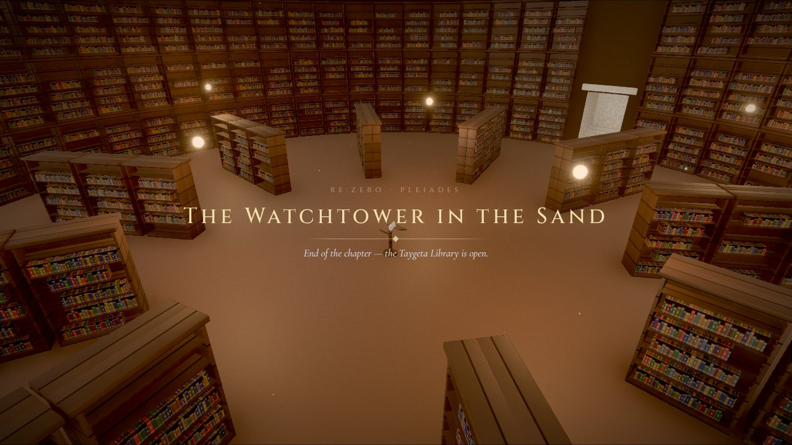
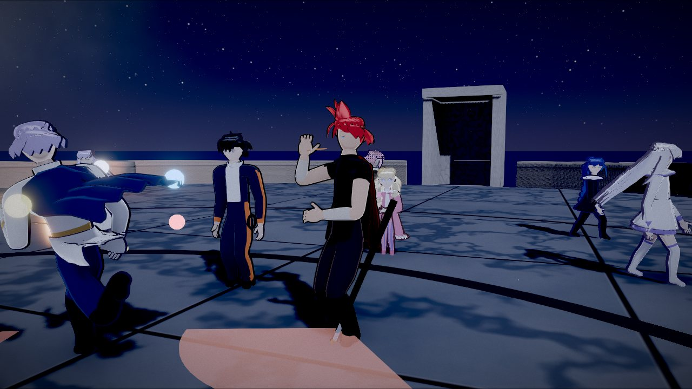
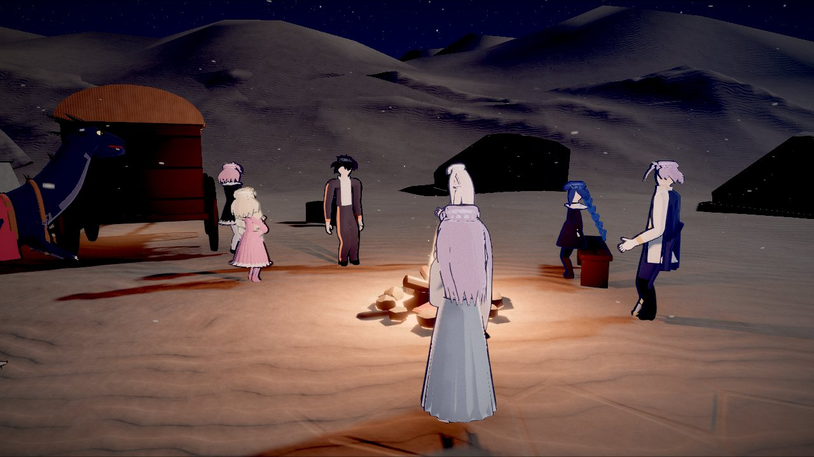
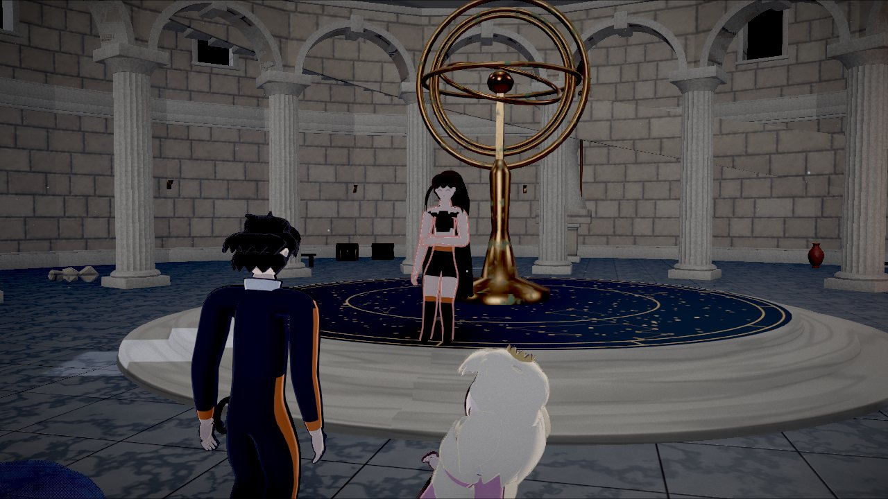
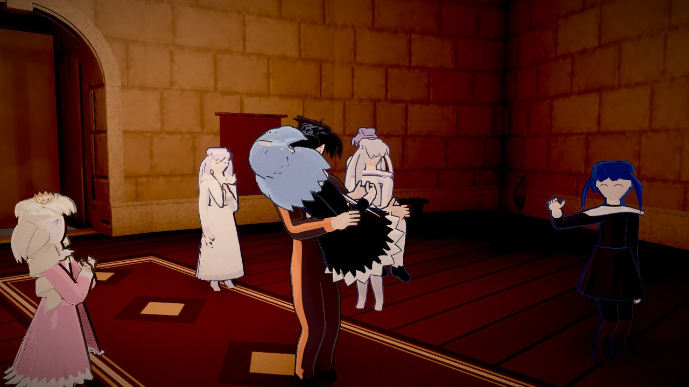
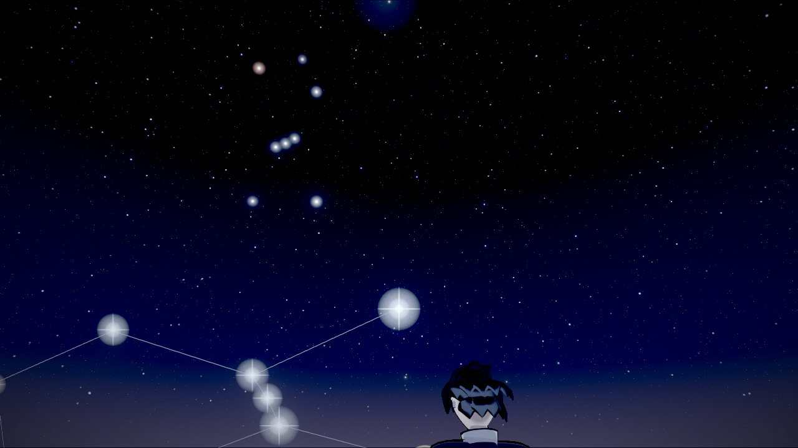

# Re:Zero - Pleiades

A third-person action-adventure RPG adapting *Re:Zero* Arc 6 — the Pleiades
Watchtower — built for the browser with Three.js, Rapier and a headless Blender
asset pipeline.

> Fan project. *Re:Zero − Starting Life in Another World* and its characters
> belong to Tappei Nagatsuki, Shinichirou Otsuka and Kadokawa.



## What's in it

**The vertical slice — "The Watchtower in the Sand"** plays end to end, from the
title screen to the chapter card:

- **The camp at the tower's foot** — the party (Emilia, Beatrice, Julius, Ram,
  Meili, Anastasia, Patrasche) and Rem, asleep in the carriage.
- **The Glass Flats** — run on the glass and the light from the summit kills you.
  **Return by Death** sends Subaru back to his last return point with only what
  he knows: the world rewinds, knowledge doesn't. Try to tell anyone and the
  Witch's hand closes around his heart.
- **The gate plaza** — a jackal pack in two waves, then the **Sand Earthworm**,
  too big to fight. The answer is on the glass: ring the carriage bell out there,
  hide behind stone, and let the light take it.
- **Celaeno** — Shaula, the Star Guardian, and the tower's rules (break one and
  she keeps her word).
- **Alcyone** — carrying Rem up the stair to the Green Room.
- **Taygeta** — a white room that becomes a sky full of stars within reach, and a
  riddle only someone from Earth can answer.

**And beyond it** (Phase 11): Taygeta's library of the **Books of the Dead** —
look for Rem's book and find none, read a stranger's last morning — and
**Electra**, where the first Sword Saint, Reid Astrea, fights the whole party
with a pair of chopsticks.



Around all of it: a party that follows, fights and banters; telegraphed combat
with Subaru's whip, Shamak and E·M·M; data-driven dialogue with choices that
only open up because of what Subaru learned by dying; cinematics; quests and a
journal; saves; JRPG menus; an adaptive synthesized score; device-matched button
prompts for keyboard, Xbox and PlayStation pads; graphics presets.

| | |
|---|---|
|  |  |
|  |  |

## Running

```bash
npm install
npm run dev          # http://127.0.0.1:5173
```

URL parameters: `?area=<id>&spawn=<id>` start in a given area; `?dev=1` enables the
developer console (` or F1) in production builds.

### Controls

| Action | Keyboard & mouse | Action | Keyboard & mouse |
| --- | --- | --- | --- |
| Move / look | WASD / mouse | Interact | E |
| Sprint / walk | Shift / C | Jump · dodge in combat | Space / Alt |
| Whip | Left mouse | Snare (heavy) | Right mouse |
| Lock on / switch | Q or middle mouse / Z, X | Shamak / E·M·M | 1 / 2 |
| Tonic | R | Party: focus / regroup | F / T |
| Inventory / journal / map | I / J / M | Pause | Esc |
| Dialogue: advance / auto / skip / log | Space / A / K / L | Swap shoulder / zoom | V / wheel |

Gamepads (standard mapping) work throughout; prompts switch to Xbox or
PlayStation symbols with the device in your hand. Every gameplay action can be
rebound in Settings.

## Development

```bash
npm run typecheck    # strict TypeScript
npm test             # unit tests (Vitest): combat, dialogue, quests, saves, data validation...
npm run smoke        # drives the real game in Chromium and asserts on state (14 suites)
npm run cast         # character lineup screenshots
node tools/browser/screenshots.mjs   # regenerate the screenshots in this README
```

The browser tests step the simulation at a fixed 60 Hz in software-rendered
Chromium and screenshot to `test-results/`. They take `GAME_URL` to run against a
production build instead of the dev server. `playthrough.mjs` plays the whole
slice from the title screen.

Assets are generated, not hand-made: `tools/blender/` builds the environment kit,
the tower, every character and creature with headless Blender (`bpy`), and
`tools/textures/` generates tiling textures with numpy.

See [DEVELOPMENT_STATUS.md](DEVELOPMENT_STATUS.md) for every system in detail,
test coverage, known issues and technical decisions, and
[docs/VERTICAL_SLICE.md](docs/VERTICAL_SLICE.md) for the slice's design.

## Layout

```
src/
  game/        composition root and main loop
  core/        event bus, entity/component world, time, scheduler, math
  areas/       the tower's foot, Celaeno, Alcyone, Taygeta, Electra (lazily loaded)
  story/       story director, dialogue, cinematics, quests, Return by Death
  data/        characters, dialogue, cinematics, quests, knowledge, items — as data
  characters/  anime character rig: procedural animation, faces, springs, toon shading
  creatures/   quadrupeds and the Sand Earthworm
  actors/      NPC controllers   party/     followers, chatter
  combat/      damage, telegraphs, Subaru's kit, companion styles
  enemies/     pack AI, the earthworm
  player/ camera/ physics/ input/ render/ vfx/ audio/ ui/ save/ settings/ world/ debug/
tools/
  browser/     Playwright harness and the browser test suites
  blender/     headless Blender asset pipeline
  textures/    texture generation
tests/         unit tests
```
