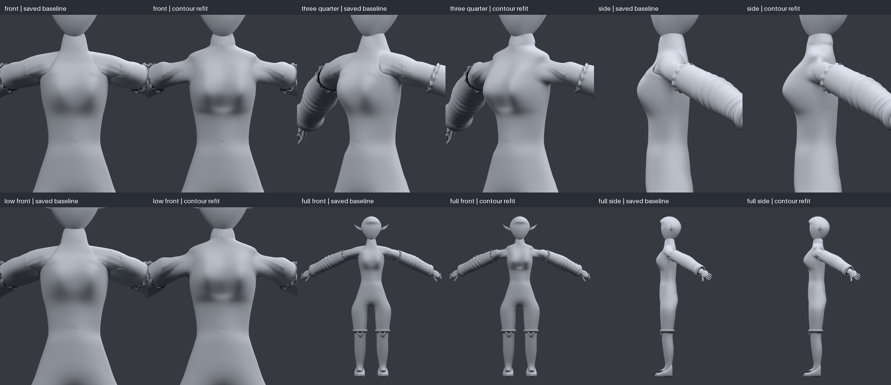
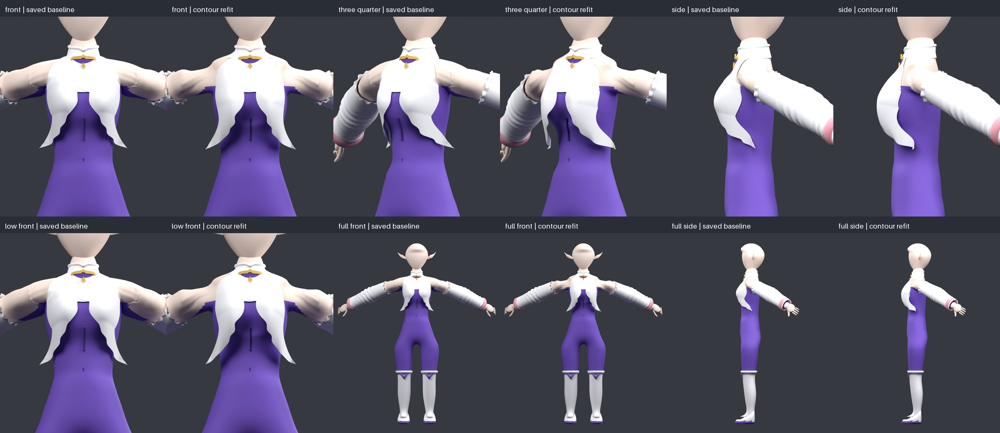
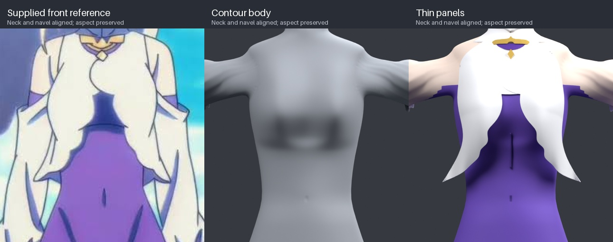
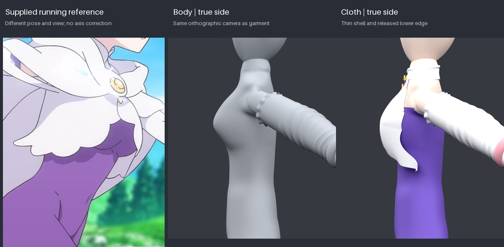
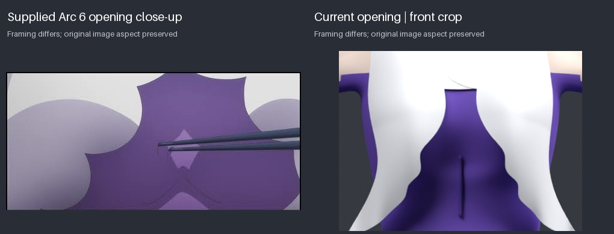

# Emilia upper torso and front cloth refit

This continues the existing `codex/emilia-arc6-contour-refit` working tree,
whose foundation is `c97eceef3b469d9c2bf650ed62f1e5b3679874ab`. The current
diagnostic renders were saved unchanged in `before/` before this refit.
They are comparison checkpoints. The three supplied anime images are the
design sources; earlier model attempts are historical evidence only.

The new upper body is an actual contour mesh. `emilia_torso_surface.py`
removes the central upper Skin branch and constructs a regular angular/height
quad grid. Natural C2 height curves pass through front widths and direct
center, 30-degree and 60-degree depths. Clamped C2 transverse curves join
these landmarks to the posterior ribcage. This replaces the old radial
displacement of a branching mesh and its anterior spread formula in the
upper torso. No chest spheres, ellipsoid unions or additional bust volumes
run on the new surface.

The lower graft follows the retained wall before a quintic transition into
the loft. Unequal graft loops are joined by their actual polar angles rather
than vertex-count fractions, eliminating the visible lower seam. Hermite
bridges connect axillary windows to the retained arm loops. Local paired
fairing smooths their variable sampling while holding X fixed. The central
depth landmarks were made shallower in their lateral difference to remove
the deep sternum groove while retaining the sloping upper/outer contour.
These changes leave the accepted waist, hips, legs and lower abdomen intact.

The cloth pattern is defined first in front X/Z coordinates. Each panel has
its own trace from `IMG_1592.jpeg`, normalized using the neck foot and navel.
The S-shaped lap and curved opening also follow `IMG_1694.jpeg`. A separate
depth field fits this pattern over the completed body. Its upper supports
come from the body, and its descending spans release toward their lower
edges. A constrained thin-sheet bending fit replaces hard minimum-slope
rows and membrane-only averaging, which left a horizontal curvature band.
The running reference informs the released side behavior. Thickness is
1.394 mm; the panels have no padded rim, cup shell or edge inflation.

| Supplied image | Observations used |
| --- | --- |
| No-cloak front, `IMG_1592.jpeg` | Neck foot about y=245, navel about y=451, center x=276. Upper opening about x=264–288 at y=318, widening to x=247–308 near y=365. Outer tips about x=190 and x=364 at y=429. The two traces retain their different edge directions. |
| Running view, `IMG_1693.jpeg` | Sloping upper front, lower supported crest, restrained abdomen, and thin cloth returning toward released lower edges. Pose and cape obstruction prevent an exact orthographic depth trace. |
| Opening close-up, `IMG_1694.jpeg` | Soft curved inner edges around exposed purple fabric, with gentle changes of direction. Framing differs from the full front image. |

The 40-degree contour is reconciled with the front and running view. There
is no independently supplied orthographic 3/4 reference, so it remains an
inferred 3D constraint, not an independently measured character dimension.











All before/after and body/garment camera records agree exactly, including the
58-degree arm sweep. Views are front, 40-degree front 3/4, side, low front,
full front and full side. Projection is orthographic; PNGs are 600×720.
Hair, cape, hoods and obstructing ornaments are hidden only for inspection.
The front comparison uses the neck/navel scale with image aspect preserved.
Running and opening comparisons preserve aspect and label framing differences.

| Check | Result |
| --- | --- |
| Complete raw body | 26,972 vertices; 27,258 faces; no boundary/nonmanifold edges, degenerate faces or nonfinite coordinates |
| Nonadjacent transverse triangle crossings | 0; coplanar/shared-vertex contacts are outside this audit's scope |
| Preserved lower body below 0.655H | All 6,321 vertices match the saved checkpoint exactly in both nearest-coordinate directions |
| Cloth fit | 45,089 samples; 0 penetrations; minimum signed clearance 2.123 mm |
| Exported garment | 2 panels, 1.394 mm thickness; valid indices and normalized skin weights |
| Excluded cape/hood data | Mesh attributes, indices, materials, transforms, inverse binds and cape joint transforms remain identical to the immutable c97 parts |
| Application checks | 72 tests passed; production build passed |

The delivered `public/assets/models/characters/emilia.glb` is the reviewed
garment export, copied without another build. Its SHA-256 is
`045956512ef7dd6b1b289677dbd8e6c5d84289ffee2842bb2f03b4c9a813b149`.
The separate `emilia-body-only.glb` is the saved upper-mesh checkpoint.
The previous runtime-pose screenshots are historical; they were not
regenerated for this revision.

The render diagnosis is recorded in [render-diagnosis.md](render-diagnosis.md).
An isolated front render saved all outputs, then the installed native bpy
wheel crashed during Python finalization. No GLB-import or camera hang was
reproduced. `run_bpy_script.py` flushes outputs and bypasses native teardown
only after normal script completion. External timeouts bound every job.
The original stuck status cannot be attributed conclusively because its
process/log state was no longer present.

Render the delivered GLB by itself from the repository root:

```bash
timeout --signal=TERM --kill-after=5s 90s \
  tools/blender/.cache/venv/bin/python -u tools/blender/run_bpy_script.py \
  tools/blender/review_emilia.py \
  --glb public/assets/models/characters/emilia.glb \
  --out test-results/emilia-current-review
```

Use `--views side` to isolate one view. To inspect the saved body, use
`--glb docs/model-reviews/emilia-arc6-silhouette-refit/emilia-body-only.glb`
and `--clay`. These commands import existing GLBs and do not rebuild geometry.
